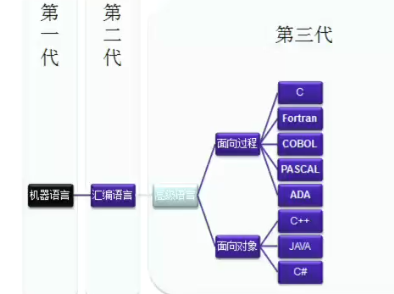

* [Introduction](INTRODUCTION.md)
* [C](C/README.md)
* [python](python/readme.md)
* [go](go/readme.md)
* java

计算机语言发展史：

这门语言是什么，为什么要创造这门语言，以及这门语言要解决什么问题。

#计算机语言发展史

- 所有计算机都基于冯诺依曼体系结构。
- 贝尔实验室发明了C语言,c++,晶体管。
- 硬件公司：intel,AMD
- SUN公司：java
- Java核心优势：跨平台